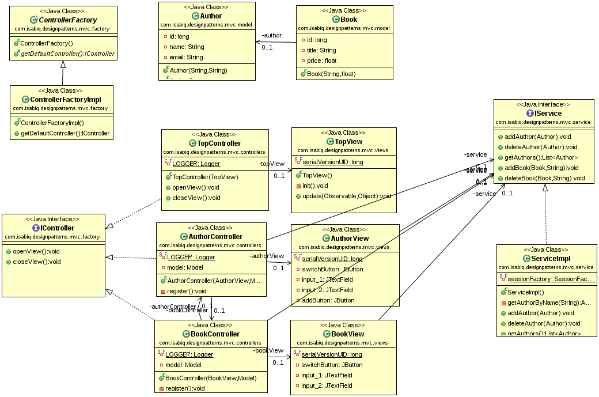

## Summary
This MVC implementation respects the following :
* The model is an independent component, it represent the application business side. It's also responsible for notifying views for changes (observer pattern).
* The controller is responsible for handling user actions and inputs and sending commands to its views and the model.
* The view receives notifications and ask the model for updates. It is also responsible for managing the components to be displayed, in response to the controller commands.

## Advantages

* TODO

## Limits

* TODO

## References

* [The "Gang of Four" - Design Patterns: Elements of Reusable Object-Oriented Software](https://en.wikipedia.org/wiki/Design_Patterns)
