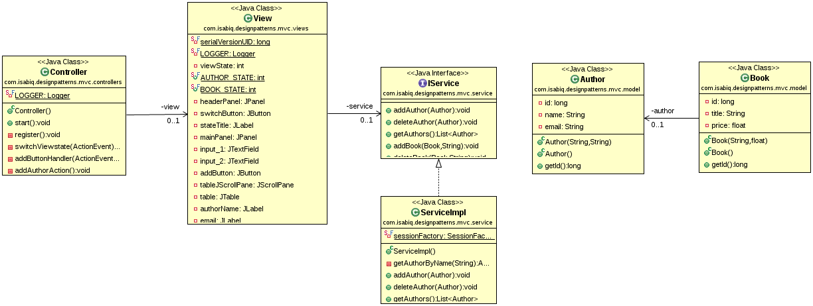

## Summary
This MVC implementation respects the following :
* The model is an independent component, it represent the application business side.
* The controller is responsible for handling user actions and inputs and sending commands to its views.
* The view is responsible for sending commands to the model and receiving updates. It is also responsible for managing the components to be displayed, in response to the controller commands.

## Advantages

* Very simple to follow and straightforward in making decisions.
* Can make use of data binding between the view and the model, which make updating the view easier.
* No complexity in building objects and starting the application.

## Limits

* The view does seem to have many responsibilities. Since it is the one building and managing the view components, updating the model and receiving results from it.
* Their is no support for communication between controllers or between views.

## References

* [Trygve Reenskaug - THING-MODEL-VIEW-EDITOR](https://heim.ifi.uio.no/~trygver/1979/mvc-1/1979-05-MVC.pdf)
* [Trygve Reenskaug - MODELS-VIEWS-CONTROLLERS](https://heim.ifi.uio.no/~trygver/1979/mvc-2/1979-12-MVC.pdf)
