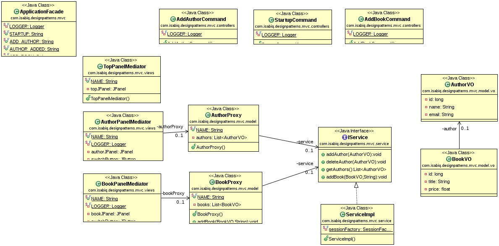

## Summary
This MVC implementation respects the following :
* The model is an independent component, it represent the application business side.
* The proxy is responsible for executing the commands model and reusing its results.
* The command interact with proxies to execute actions coming from the Mediator, and notify it back for results.
* The Mediator is responsible for creating and managing views, and listen to notifications coming from the commands.

## Advantages

* TODO

## Limits

* TODO

## References

* [PureMVC/puremvc-java-demo-gwt-employeeadmin](https://github.com/PureMVC/puremvc-java-demo-gwt-employeeadmin)
* [PureMVC Framework Overview with UML](http://puremvc.org/docs/PureMVC_Framework_Overview_with_UML.pdf)
